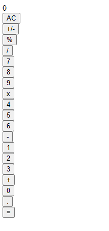

Claro, a continuación te proporciono una descripción paso a paso de cómo se creó la calculadora:

# Calculadora React

Esta es una calculadora simple creada con React, que permite realizar operaciones básicas de suma, resta, multiplicación y división. La calculadora muestra los números y operadores seleccionados en tiempo real y permite obtener el resultado final de la operación. En esta primera parte del video solo se puede evidenciar la parte logica del proyecto y no ele estilo

## Pasos para crear la calculadora:

1. **Configuración del proyecto**

   - Se creó un nuevo proyecto de React utilizando `create-react-app`.
   - Se configuraron los archivos y directorios necesarios para el proyecto.
   - Se instalo la libreria Big.js

   ## Instalación de Big.js

   Para realizar operaciones aritméticas precisas y manejar correctamente los números decimales, la calculadora utiliza la librería `Big.js`. Antes de utilizar la calculadora, asegúrate de instalar esta librería en tu proyecto.

   1. Ejecuta el siguiente comando en la terminal dentro del directorio de tu proyecto para instalar `Big.js` y guardarla como una dependencia en tu proyecto:

   <pre>

bash<button class="flex ml-auto gap-2"><svg stroke="currentColor" fill="none" stroke-width="2" viewBox="0 0 24 24" stroke-linecap="round" stroke-linejoin="round" class="h-4 w-4" height="1em" width="1em" xmlns="http://www.w3.org/2000/svg"><path d="M16 4h2a2 2 0 0 1 2 2v14a2 2 0 0 1-2 2H6a2 2 0 0 1-2-2V6a2 2 0 0 1 2-2h2"></path><rect x="8" y="2" width="8" height="4" rx="1" ry="1"></rect></svg>Copy code</button>

<code class="!whitespace-pre hljs language-bash">npm install big.js
   </code>

</pre>

   2. Después de la instalación, puedes importar `Big` en los archivos donde necesitas realizar operaciones precisas con números decimales. Por ejemplo, en `operaciones.js`:

   <pre>

javascript<button class="flex ml-auto gap-2"><svg stroke="currentColor" fill="none" stroke-width="2" viewBox="0 0 24 24" stroke-linecap="round" stroke-linejoin="round" class="h-4 w-4" height="1em" width="1em" xmlns="http://www.w3.org/2000/svg"><path d="M16 4h2a2 2 0 0 1 2 2v14a2 2 0 0 1-2 2H6a2 2 0 0 1-2-2V6a2 2 0 0 1 2-2h2"></path><rect x="8" y="2" width="8" height="4" rx="1" ry="1"></rect></svg>Copy code</button>

<code class="!whitespace-pre hljs language-javascript">import Big from "big.js";

   // Resto del código de operaciones.js</code>

</pre>
2. **Creación de los componentes**

   - Se crearon los siguientes componentes funcionales:
     - `App`: El componente principal que contiene toda la lógica de la calculadora.
     - `Display`: El componente que muestra el valor actual de la operación.
     - `Button`: El componente para los botones numéricos y de operadores.
     - `PanelDeBotones`: El componente que agrupa los botones de la calculadora.
3. **Lógica de la calculadora**

   - Se implementó la lógica de la calculadora en el archivo `operaciones.js`.
   - La función `operaciones` recibe el estado actual y el nombre del botón presionado como parámetros.
   - La función realiza diferentes acciones según el botón presionado, como agregar números, operadores, realizar cálculos y mostrar resultados.
4. **Validación de números**

   - Se utilizó la función `isNumber` en el archivo `isNumber.js` para verificar si un elemento es un número válido.
5. **Componente `App`**

   - El componente `App` es el componente principal que contiene el estado de la calculadora.
   - Se inicializó el estado con los valores iniciales de `total`, `siguiente` y `operador` a `null`.
   - Se creó la función `handleClick` para manejar los clics en los botones y actualizar el estado de la calculadora utilizando la función `operaciones`.
6. **Componente `Display`**

   - El componente `Display` muestra el valor actual de la operación, ya sea el número siguiente o el resultado total.
7. **Componente `Button`**

   - El componente `Button` representa un botón individual de la calculadora.
   - Se implementó la lógica para asignar diferentes estilos a los botones numéricos, de operadores y especiales.
8. **Componente `PanelDeBotones`**

   - El componente `PanelDeBotones` agrupa los botones de la calculadora en diferentes filas.
   - Se importaron y utilizaron los botones del componente `Button` en este componente, pasando la función `handleClick` como prop.
9. **Prueba de la calculadora**

- Se probó la calculadora para asegurarse de que las operaciones básicas funcionan correctamente.
- Se verificó que el resultado se actualiza correctamente en el `Display` después de cada operación.

## Evidencias de la Ejecucion del Poryecto

¡Listo! Ahora la calculadora está lista para ser utilizada y puede realizar operaciones básicas de manera precisa y rápida.
